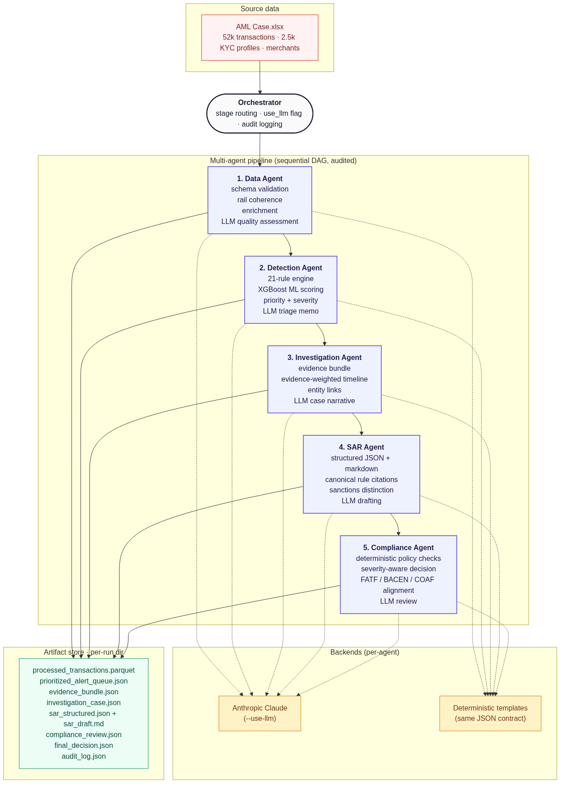

# AML-FT Multi-Agent Investigation System

End-to-end AML/FT investigation pipeline for a Brazilian fintech: 21-rule detection engine + XGBoost prioritization + Anthropic Claude multi-agent orchestration. Produces audit-trailed, SAR-ready outputs in cautious investigative language with deterministic fallback for every LLM-using agent.

---

## Executive summary

Given 52,000 transactions and 2,500 KYC profiles across four months, the system surfaces suspicious entities, ranks them, builds evidence-grounded investigation cases, drafts SAR reports, and applies compliance review — every stage explainable, every artifact reproducible. Five Anthropic-backed agents are orchestrated via a sequential DAG; each ships a deterministic template backend producing the same JSON contract, so the system runs with or without an API key.

---

## Key results

- **C102290** — designated **investigative showcase case**. PEP customer (KYC=98), 144× income mismatch, 2,013% passthrough, Tor + 2 VPN events, single-day burst (R$42k), shared receiving merchants with C100880. Strongest multi-typology convergence in the dataset. Full SAR: [`docs/phase1/SAR-2025-C102290-01.md`](docs/phase1/SAR-2025-C102290-01.md). ML Tier 1 (calibrated probability 1.00) driven by behavioral signals — see [`docs/phase3/Phase3_ML_Summary.md`](docs/phase3/Phase3_ML_Summary.md).
- **C100091** — highest **operational escalation priority** (rank #1 by composite priority score). Driven by a single transactional sanctions screening event. The customer's KYC profile shows no confirmed sanctions match, so this is preserved as a "screening event requiring review" rather than a confirmed exposure.
- **Operational vs investigative distinction is explicit.** Priority score answers "what must escalate today?" — investigative richness answers "what best demonstrates the system's depth?" Both signals are surfaced; neither overwrites the other.

---

## Architecture

```
Data → Rules → ML → Investigation → SAR → Compliance
```

Sequential agent DAG with shared artifact store, orchestrator-managed audit trail, and per-agent LLM/template backend selection.



Mermaid source: [`docs/architecture/architecture.mmd`](docs/architecture/architecture.mmd)

---

## Project structure

```
CW/
├── agents/                    Phase 4 multi-agent system
│   ├── data_agent/            Ingestion + LLM quality assessment
│   ├── detection_agent/       Rules + ML + LLM triage memo
│   ├── investigation_agent/   Evidence bundle + LLM case narrative
│   ├── sar_agent/             SAR drafting (JSON + markdown)
│   ├── compliance_agent/      Policy checks + LLM regulatory review
│   ├── orchestrator/          Stage routing + audit logging
│   ├── aml_constants.py       Canonical rule descriptions + sanctions logic
│   ├── priority.py            Deterministic priority + severity scoring
│   └── shared.py              soften_language, ml_confidence_band, RunContext
├── src/
│   ├── rules/                 21-rule alerts engine (Phase 2)
│   └── ml/                    XGBoost prioritization + SHAP (Phase 3)
│       ├── ml_pipeline.py     XGBoost regression on behavioral_risk_score
│       └── isolation_forest.py Unsupervised anomaly detection (raw features only)
├── docs/
│   ├── architecture/          Pipeline diagram (mmd + png)
│   ├── phase1/                Phase 1 manual investigation + SAR-2025-C102290
│   ├── phase4/                Multi-agent architecture deep-dive
│   └── final_summary.md       Two-page delivery narrative
├── outputs/
│   ├── examples/showcase_run/ Canonical example output (committed)
│   ├── phase4_demo/runs/      Per-run artifacts (gitignored — regenerate locally)
│   ├── figures/               SHAP / chart PNGs
│   └── rankings/              Phase 2/3 CSV outputs
├── data/                      Source xlsx
├── README.md
├── requirements.txt
└── .env.example
```

---

## Phase breakdown

| Phase | Focus | Key artifact |
|---|---|---|
| **1 — Investigation** | 9-subject manual cohort + 1 showcase SAR (C102290) | [`docs/phase1/`](docs/phase1/) |
| **2 — Rules engine** | 21 deterministic rules, composite scoring, escalation bands | [`src/rules/alerts_engine.py`](src/rules/alerts_engine.py) |
| **3 — ML prioritization** | XGBoost regression on a behavioral risk target (R02/R03/R09 rule subset), trained on all 2,500 customers; hard alerts (R08/R16/R21) stay with the rules engine. Isolation Forest score and counterparty-network features feed in; isotonic calibration produces meaningful probabilities. SHAP per customer. | [`src/ml/ml_pipeline.py`](src/ml/ml_pipeline.py) · [`src/ml/isolation_forest.py`](src/ml/isolation_forest.py) |
| **4 — Multi-agent orchestration** | 5 LLM agents + orchestrator with deterministic fallback | [`agents/`](agents/) |

---

## Multi-agent system

| Agent | Responsibility | LLM role |
|---|---|---|
| **Data Agent** | Schema validation, rail coherence, enrichment, quality report | Risk-concentration observations on the dataset |
| **Detection Agent** | Runs 21 rules + XGBoost; builds prioritized queue with cohort-relative ML bands | Cross-customer pattern detection + triage memo |
| **Investigation Agent** | Evidence bundle, evidence-weighted timeline (anonymization / sanctions / Wire / burst / cross-border milestones), entity links | Narrative case writeup grounded in bundle facts only |
| **SAR Agent** | Structured JSON + markdown SAR draft, canonical rule citations, sanctions distinction | Drafts SAR in cautious investigative language |
| **Compliance Agent** | Mandatory-field / SLA / jurisdiction policy checks, severity-aware decision | Regulatory alignment review (FATF / BACEN / COAF) |
| **Orchestrator** | Routes stages, propagates `--use-llm`, appends to `audit_log.json`, manages run dirs | n/a |

Every LLM call has a deterministic template fallback producing the same JSON contract.

---

## Running the system

**Requirements:** Python 3.10+, dependencies via `pip install -r requirements.txt`.

```bash
# 1. Install
pip install -r requirements.txt

# 2. Configure (LLM mode only)
cp .env.example .env
# edit .env and set ANTHROPIC_API_KEY=...

# 3a. Run with deterministic backends (no API calls)
python -m agents.orchestrator.orchestrator --top-n 10

# 3b. Run with Anthropic Claude as the backend for all agents
python -m agents.orchestrator.orchestrator --top-n 10 --use-llm
```

Each invocation creates a fresh `outputs/phase4_demo/runs/<timestamp>/` directory. The orchestrator writes:

- `processed_*.parquet` (data agent)
- `prioritized_alert_queue.json` (detection)
- `evidence_bundle.json`, `investigation_case.json`, `investigation_summary.md` (investigation)
- `sar_structured.json`, `sar_draft.md` (SAR)
- `compliance_review.json`, `final_decision.json` (compliance)
- `audit_log.json` (orchestrator, appended throughout)

To re-run only the latest stage against a cached run, pass `--run-id <existing-id>`.

---

## Example outputs

A committed canonical run lives under [`outputs/examples/showcase_run/`](outputs/examples/showcase_run/):

- `investigation_summary.md` — per-customer case writeup with timeline + cohort ML band
- `sar_draft.md` — full SAR with case identification, executive summary, triggered alerts, regulatory basis
- `final_decision.json` — compliance review with approve / revise / escalate_manual_review

---

## Limitations

- **Synthetic dataset.** Behavior was not validated against real customer ground truth.
- **Weak-label ML training (mitigated).** Labels are still derived from the rules engine, but the v2 pipeline narrows the target to the **behavioral-soft** subset (R02 structuring, R03 income mismatch, R09 PEP) and explicitly excludes hard alerts (R08 sanctions, R16 self-merchant, R21 network linkage) from the target — those are binary regulatory facts owned by the rules engine, not patterns ML should be asked to predict from transactional behavior. The remaining 15 rules are held out and survive only as raw aggregates the model must rediscover. Three independent signals therefore feed the analyst queue: the rules engine (regulatory facts), the XGBoost regressor (behavioral risk), and Isolation Forest (unsupervised anomaly, no labels). Agreement across layers strengthens confidence; divergence is informative.
- **No real sanctions verification.** OFAC, BACEN, EU sanctions lists are not integrated. Sanctions screening events are treated as preliminary indicators only.
- **No human-in-the-loop feedback.** There is no analyst-decision capture or model retraining loop.
- **No production monitoring or drift handling.** This is a delivery prototype, not a deployed system.
- **Shallow network analysis.** Direct wires between flagged subjects are surfaced, but transitive network paths are not analyzed.

---

## Future improvements

- **Analyst feedback loop** — capture compliance officer decisions; close the supervised-learning gap
- **Calibration monitoring** — track score distribution drift over time
- **Graph-native investigations** — transitive entity / device / IP / merchant subgraphs
- **Human-in-the-loop review UI** — analyst-facing case dashboard with comment trail
- **Live sanctions integration** — OFAC / BACEN / EU list lookups during detection

---

## Reviewer entry points

| To understand… | Read… |
|---|---|
| **Why C102290** is the showcase | [`docs/phase1/Phase1-Investigation-Report.md`](docs/phase1/Phase1-Investigation-Report.md) |
| **The full investigation method** | [`docs/phase1/SAR-2025-C102290-01.md`](docs/phase1/SAR-2025-C102290-01.md) |
| **Multi-agent system in depth** | [`docs/phase4/Phase4_MultiAgent_Architecture.md`](docs/phase4/Phase4_MultiAgent_Architecture.md) |
| **Two-page narrative for delivery** | [`docs/final_summary.md`](docs/final_summary.md) |
| **Live example output** | [`outputs/examples/showcase_run/`](outputs/examples/showcase_run/) |
| **Architecture diagram** | [`docs/architecture/architecture.png`](docs/architecture/architecture.png) |
