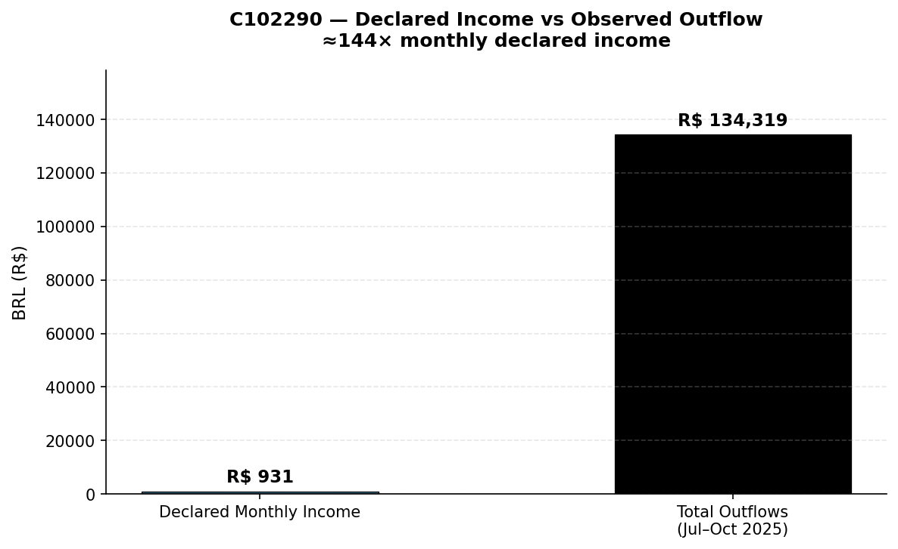

# SUSPICIOUS ACTIVITY REPORT (SAR)
**Internal Reference:** SAR-2025-C102290-01
**Filing Institution:** CloudWalk INC — AML/FT Compliance Unit
**Prepared by:** Senior AML Investigator
**Date of Issue:** 2025-11-15
**Classification:** Internal — Compliance Restricted

---

## 1. CASE IDENTIFICATION

| Field | Detail |
|---|---|
| **Primary Subject** | C102290 |
| **Subject Name** | [Redacted] |
| **Declared Occupation** | Driver |
| **Declared Annual Income** | R$11,177 (≈ R$931/month) |
| **PEP Status** | Yes |
| **KYC Risk Score** | 98 / 100 |
| **Risk Rating (categorical)** | Medium ⚠ (inconsistent with PEP/score — see Section 3) |
| **KYC Tier** | L1 ⚠ (lowest verification tier — inconsistent with PEP status) |
| **Sanctions Screening** | No direct hit |
| **Review Period** | 2025-07-01 to 2025-10-31 |
| **Transaction Rails Observed** | PIX (16), Card (10), Wire (1) |
| **Total Outflow Volume** | R$134,319 |
| **Total Inflow Volume (Platform)** | R$5,367 |
| **Cross-Border Exposure** | Yes — single geo-tagged transaction to AE (UAE) |
| **Linked Entities (Relevant)** | M200460, M200186 (shared receiving merchants with C100880); C100880 (separately under review) |

---

## 2. EXECUTIVE SUMMARY

C102290 is a PEP-designated customer whose transaction activity over the four-month review period appears materially inconsistent with the declared customer profile. Total outflows of R$134,319 represent approximately 144 times the customer's declared monthly income. The account exhibits multiple concurrent risk indicators including IP anonymization (Tor + VPN), single-day velocity bursts, a passthrough ratio of 2,013% between observed platform inflows and outflows, and shared receiving merchants with a separately-flagged subject (C100880). Given the customer's PEP status and KYC risk score of 98/100, Enhanced Due Diligence is regulatorily required, and the combined risk profile warrants escalation for SAR filing consideration and immediate compliance review.

---

## 3. TRIGGERED ALERTS / RULES

| Alert | Detection Logic | Date / Time | Tx ID(s) | Relevance |
|---|---|---|---|---|
| **PEP-EDD-001** | Customer flagged PEP=Yes; mandatory EDD trigger | KYC record (ongoing) | — (customer-level) | Mandatory EDD per FATF Rec. 12 / Circular BACEN 3.978 |
| **VEL-BURST-002** | ≥4 transactions in single calendar day | 2025-08-01 · 04:19 – 21:49 (4 txs, R$42,590) | **TJQAMN5JTWDXB**, **TVK4KFT22QPUH** (2 highest-value of 4) | Daily burst inconsistent with declared income |
| **PASSTHRU-003** | (Outflow ÷ Inflow) > 200% on platform | Review period 2025-07-01 → 2025-10-31; ratio 2,013% | — (aggregate metric) | Funds likely originate outside monitored platform |
| **ANON-IP-004** | Use of Tor / VPN / Proxy on financial transactions | 2025-08-12 02:50 (VPN, Wire); 2025-09-28 21:35 (VPN, PIX); 2025-10-03 20:03 (Tor, Card) | **TB24ZK5RW3PP8**, **TZ76800M19NE3**, **TNUU7IUG3D1A2** | Network anonymization inconsistent with low-risk customer profile |
| **INCOME-MISMATCH-005** | Outflow > 50× declared monthly income | Review period aggregate (R$134k vs R$931/mo ≈ 144×) | — (aggregate metric) | Material disparity vs declared profile |
| **GEO-RISK-006** | Cross-border geo to monitored jurisdiction | 2025-07-10 11:52 (Card, R$3,196 → AE) | **TLRPWM2IMAYPY** | Low individual weight; relevant in aggregate |
| **KYC-INCONSISTENCY-011** | PEP=Yes and/or KYC Risk Score ≥80 combined with categorical risk_rating < High or tier = L1 | KYC profile (ongoing); contradictory classification: PEP=Yes, Score=98, Rating=Medium, Tier=L1 | — (KYC-level) | Internal KYC control gap; requires governance review |

---

## 4. DETAILED ANALYSIS

### 4.1 Chronological Timeline (Key Events)

| Date | Event | Detail |
|---|---|---|
| **2025-07** | Initial period | Routine activity baseline; activity already elevated relative to declared income |
| **2025-07-10 11:52** | UAE geo-tag | Card transaction TLRPWM2IMAYPY (R$3,196) geo-tagged to AE — single cross-border event |
| **2025-08-01 04:19–21:49** | **Velocity burst** | 4 PIX transactions in single day totalling **R$42,590.11**, including R$20,509 + R$11,742 high-value pair within ~18-hour window |
| **2025-08-12 02:50** | Wire + first anonymization | Wire to M200662 (R$1,364) — cross-rail activity initiated; transaction routed via VPN |
| **2025-09-28 21:35** | VPN-routed PIX | PIX to M200393 (R$8,506) routed via VPN |
| **2025-10-03 20:03** | Tor-routed Card | Card transaction to M200122 (R$3,835, MCC 6011 — ATM/cash) routed via Tor — escalation to higher-grade anonymization |
| **Review-end** | Aggregate | R$134,319 sent across 27 transactions to 27 distinct counterparties |

### 4.2 Behavioral Summary

| Indicator | Observation | Assessment |
|---|---|---|
| **Volume vs declared income** | R$134,319 outflow vs R$931/mo declared income (≈144×) | Materially inconsistent with customer profile |
| **Counterparty fan-out** | 27 distinct receiving counterparties | Wide dispersion consistent with layering-type behavior |
| **Cash-in / cash-out asymmetry** | Inflow R$5,367 vs Outflow R$108,041 (PIX only) → 2,013% passthrough | Indicates funds originating outside platform visibility |
| **Anonymization tools** | 2× VPN + 1× Tor | Consistent with deliberate network anonymization; warrants explanation under EDD |
| **Multi-rail use** | PIX (16) + Card (10) + Wire (1) | Multi-rail activity consistent with layering typology indicators |
| **Shared counterparties** | Shares M200460 and M200186 with C100880 (separately flagged) | Merchant convergence point; warrants merchant-level review |
| **Geo-risk** | 1× AE cross-border | Low standalone weight; included for aggregate context |
| **Device / IP reuse** | No shared device fingerprint or IP address identifiers identified across reviewed linked entities | Absence of shared technical identifiers; documented for completeness |



*Observed transaction outflows materially exceeded the customer's declared income profile (~144× monthly declared income).*

### 4.3 Key Findings

- The **income-to-volume disparity (≈144×)** is the primary quantitative indicator. No source-of-funds documentation supporting this activity level has been recorded in the current case file.
- The **2,013% passthrough ratio** indicates that the majority of distributed funds do not originate from observable inflows on the platform. This is consistent with — though does not confirm — funds arriving via off-platform channels (cash, other institutions, or third-party rails).
- The **concurrent use of Tor and VPN** in a customer profile declared as Driver/PEP, combined with high single-day transaction velocity, represents a constellation of indicators consistent with deliberate operational concealment.
- The **shared receiving merchants (M200460, M200186) with C100880**, who is independently under review for structuring-band activity and Tor usage, creates a relevant counterparty convergence that warrants merchant-level review.
- The KYC risk score of 98/100 already classifies this customer as high-risk; current observed activity is consistent with that risk classification and triggers mandatory EDD obligations.

---

## 5. REGULATORY / TYPOLOGY BASIS

- **FATF Recommendation 12** — PEP customers require Enhanced Due Diligence, including establishment of source of funds and ongoing enhanced transaction monitoring. The observed activity profile triggers these EDD obligations.
- **FATF Typology — Layering / Multi-Rail Distribution** — Use of PIX, Card, and Wire channels with wide counterparty fan-out is consistent with layering-stage indicators.
- **FATF Recommendation 19 / Cross-Border Monitoring** — Cross-border exposure (AE) is low individual weight but is documented for aggregate risk profile.
- **COAF / Circular BACEN 3.978/2020** — Activity materially inconsistent with declared customer profile constitutes a reportable indicator. PEP status combined with anonymization tool usage and volume disparity meets institutional escalation criteria.
- **Internal Policy** — KYC risk score ≥ 80 with concurrent EDD-triggering activity requires SAR review within the standard institutional window.

---

## 6. CONCLUSION & RECOMMENDED ACTIONS

**Assessment:** The combination of PEP status, KYC risk score 98/100, income-to-volume disparity of approximately 144×, 2,013% passthrough ratio, concurrent use of Tor and VPN anonymization, single-day velocity burst, and shared receiving merchants with an independently flagged subject collectively constitute a risk profile that warrants escalation. Activity is consistent with multiple AML typology indicators; conclusions on intent are not drawn at this stage and remain subject to EDD findings.

**Confidence Level:** Moderate-to-High. Quantitative indicators (volume, ratios, transaction counts, PEP/KYC fields) are factually established. Typological interpretation is well-supported by the constellation of concurrent indicators.

**Recommended Actions:**

1. **SAR Filing** — Submit SAR to COAF in accordance with institutional reporting policy.
2. **Enhanced Due Diligence (EDD)** — Initiate documented EDD process; request source-of-funds and source-of-wealth documentation.
3. **Transaction Monitoring Escalation** — Elevate customer to enhanced monitoring tier; apply lower thresholds for ongoing alert generation.
4. **Merchant Review** — Initiate merchant risk review for M200460 and M200186 in conjunction with parallel C100880 review.
5. **Temporary Restriction Review** — Compliance Officer to assess whether transactional restrictions are warranted pending EDD outcome, in accordance with institutional risk appetite.
6. **Linked Case Coordination** — Cross-reference findings with parallel reviews on C100880, C101848, and C102360 to ensure consistent case management.
7. **KYC Governance Escalation** — The current categorical risk_rating (Medium) and KYC tier (L1) are inconsistent with the PEP designation and numeric KYC risk score of 98/100 recorded on the same profile. Refer to KYC Governance for a documented control review; this internal inconsistency may have suppressed proportionate monitoring during the review period and constitutes a control gap requiring institutional remediation.

---

## 7. ANNEXES

### A. Key Metrics Summary

| Metric | Value |
|---|---|
| Total outflows | R$134,319 |
| Total inflows (platform) | R$5,367 |
| Passthrough ratio | 2,013% |
| Income disparity | ≈144× monthly declared income |
| Distinct counterparties | 27 |
| Anonymization events | 3 (2 VPN + 1 Tor) |
| Velocity burst peak | 4 txs / R$42,590 on 2025-08-01 |
| KYC risk score | 98 / 100 |
| PEP status | Yes |

### B. Linked Entities (Relevant Only)

| Entity | Relationship | Status |
|---|---|---|
| C100880 | Shares receiving merchants M200460, M200186 | Separately under review |
| M200460 | Shared receiving merchant | Pending merchant review |
| M200186 | Shared receiving merchant | Pending merchant review |

### C. Reference Transaction IDs (Illustrative)

| Tx ID | Date | Rail | Amount | Note |
|---|---|---|---|---|
| TJQAMN5JTWDXB | 2025-08-01 04:19 | PIX | R$20,509.18 | Largest tx of Aug 1 burst (to M200888, Telecom) |
| TVK4KFT22QPUH | 2025-08-01 20:49 | PIX | R$11,742.01 | Burst tx to M200489 (Securities, MCC 6211 — High Risk) |
| TB24ZK5RW3PP8 | 2025-08-12 02:50 | Wire | R$1,364.47 | First Wire on account; routed via VPN |
| TZ76800M19NE3 | 2025-09-28 21:35 | PIX | R$8,506.10 | PIX to M200393 routed via VPN |
| TNUU7IUG3D1A2 | 2025-10-03 20:03 | Card | R$3,834.91 | Card to M200122 (MCC 6011, ATM/cash) routed via Tor |

*Full transaction listing available in case file annex on request.*

### D. Detection Logic — Representative Queries

*The pandas snippet reflects the actual analysis implementation (Python/pandas on the source dataset). The SQL equivalent is provided for reproducibility in database environments.*

**Velocity burst detection (SQL):**
```sql
SELECT sender_id, DATE(timestamp) AS day,
       COUNT(*) AS tx_count, SUM(amount_brl) AS day_total
FROM transactions
GROUP BY sender_id, DATE(timestamp)
HAVING COUNT(*) >= 4
ORDER BY day_total DESC;
```

**Income-to-outflow ranking (pandas):**
```python
outflow = txs.groupby("sender_id")["amount_brl"].sum()
monthly_income = kyc.set_index("customer_id")["annual_income_brl"] / 12
ratio = (outflow / monthly_income).sort_values(ascending=False)
ratio.head(10)   # top entities by income-disparity ratio
```

---

**Prepared for:** AML/FT Compliance Committee Review
**Next Review Trigger:** EDD response received OR 30 days from filing, whichever is earlier
**Distribution:** Internal — Compliance Officer, MLRO, Senior Investigator

---

*This report constitutes an internal compliance escalation memo. Conclusions are based on transactional and KYC data available at the time of preparation. Final SAR filing determination and any customer-facing action are subject to Compliance Officer and MLRO review.*
