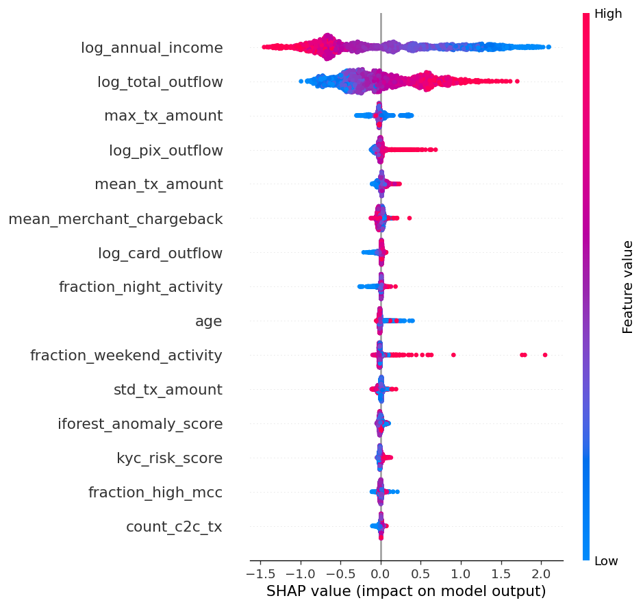
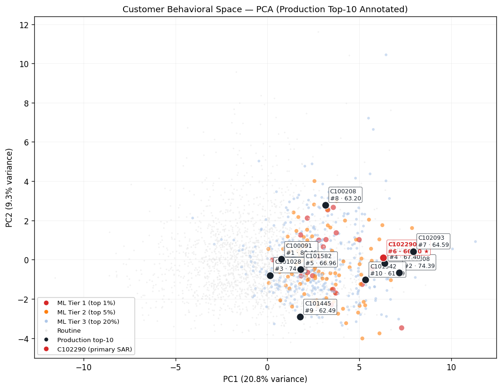

# Phase 3 — ML Prioritization Layer (v2)

_CloudWalk AML/FT Investigation Pipeline · Executive Summary_

---

## 1. Objective & positioning

The ML layer is a **behavioral prioritization** model layered on top of the Phase 2 rules engine. It produces a continuous, **calibrated** risk probability per customer to re-rank the rules-engine queue and to surface per-customer SHAP explanations for analyst review.

The v2 pipeline is built around two design decisions that distinguish it from the v1 binary classifier:

1. **Targets only what ML can honestly learn.** The regression target is `behavioral_risk_score`, the sum of weights for the **soft behavioral** core rules (R02 structuring, R03 income mismatch, R09 PEP transactional). Hard regulatory alerts (R08 sanctions, R16 self-merchant, R21 network linkage) are deliberately **excluded** from the target — those are binary regulatory facts owned by the rules engine, not patterns ML should be asked to predict from transactional aggregates.
2. **Uses the full population.** All 2,500 customers participate in training and evaluation. v1 excluded 1,726 customers in the score-4-to-12 grey zone because they could not be cleanly labeled positive or negative; v2 treats the task as regression, so every customer has a defined target.

The model is **not** framed as autonomous laundering detection. It is one of three independent signals — rules (regulatory facts) + ML (behavioral patterns) + Isolation Forest (unsupervised anomaly).

---

## 2. Architecture

```
Raw transactions + KYC + Merchants
        ↓
[ Phase 2 — Rules engine ] ─────► 21-rule alert set
        │                          composite_score · hard_alert flag
        │
        │   uses composite_score of counterparties (rules output, not
        │   model prediction → no model-feedback loop)
        ↓
[ Phase 3 — Isolation Forest ] ──► per-customer anomaly_score (input feature)
        ↓
[ Phase 3 — XGBoost regressor ] ─► predicted_score (continuous)
        ↓
[ Isotonic calibrator ]    ──────► predicted_probability ∈ [0,1]
        ↓
[ Analyst triage queue ]   ──────► re-ranked, calibrated, explained
```

The ML layer never suppresses a rule-driven escalation. It re-orders within bands and surfaces interpretive context.

---

## 3. Features & validation

**43 features across 10 groups.** v1's `pep_flag` was dropped (1:1 mechanical mapping to R09 in the target). Five new features were added:

| Group | Example features | n |
|---|---|---|
| Behavioral | `tx_count`, `distinct_active_days`, `max_txs_per_day` | 6 |
| Financial | `log_total_outflow`, `log_pix_out`, `log_pix_in`, `log_wire_outflow` | 7 |
| Geo | `distinct_geo_countries`, `count_high_risk_geo`, `count_ip_mismatch` | 4 |
| Merchant | `distinct_merchants`, `mean_merchant_chargeback`, `fraction_high_mcc` | 4 |
| Network (c2c) | `count_c2c_tx`, `distinct_c2c_counterparties`, `count_wire_sent` | 3 |
| **Network (exposure, new)** | `count_high_score_counterparties`, `max_counterparty_score`, `fraction_outflow_to_high_score`, `count_high_chargeback_merchants` | **4** |
| Device / IP | `distinct_devices`, `count_tor_events`, `count_rooted_tx` | 5 |
| Card / e-com | `count_cnp`, `count_no_3ds`, `count_chargeback_status` | 3 |
| Temporal | `fraction_night_activity`, `fraction_weekend_activity` | 2 |
| KYC static | `log_annual_income`, `kyc_risk_score`, `age`, `risk_rating_ord`, `kyc_tier_ord` | 4 |
| **Isolation Forest (new)** | `iforest_anomaly_score` | **1** |

The four network-exposure features use the rules engine's `composite_score` of each receiver as the counterparty risk signal — rules-engine output, not model prediction, so there is no model-feedback loop. The Isolation Forest score is computed by the existing `src/ml/isolation_forest.py` module (no labels, raw transaction features only) and joined as a single feature column.

**Validation.** Customer-level random 70/30 split on all 2,500 customers. Internal 25% validation cut drives XGBoost early stopping (40 rounds). The test set is held out.

A temporal split was attempted in v1 and abandoned: Phase 2 thresholds are calibrated for the 4-month review window, and a 2-month label window collapsed positive density to 64 customers — insufficient for stable training. With only 4 months of synthetic data, the task is honestly framed as **risk-profile classification at the period end**, not forward event prediction.

---

## 4. Metrics — v2 vs v1

### Same task, same model — what changed and what it means

| Metric | v1 (binary, 774 customers) | v2 (regression, 2,500 customers) | Note |
|---|---|---|---|
| Training set | 774 | **2,500** | 3.2× more data |
| Features | 39 | **43** | +1 IF, +4 network, −1 `pep_flag` |
| Target | binary `composite_score ≥ 13` or hard | `behavioral_risk_score` ∈ {0,…,9} | **different target** |
| Test R² (regression) | n/a | **0.703** | the model fits its target |
| Test Spearman vs own target | 0.769 | **0.853** | stronger rank quality on a harder task |
| Full-pop Spearman vs target | n/a | **0.870** | strong rank quality across 2,500 |
| PR-AUC (v1-labeled subset) | 0.998 | 0.957 | small drop on the inflated task |
| ROC-AUC (v1-labeled subset) | 0.995 | 0.893 | small drop on the inflated task |
| Recall@Top50 | 0.298 | 0.289 | both at mathematical ceiling (k=50, ~170 positives) |
| Calibrated probability | no | **yes** (isotonic) | downstream agents get a meaningful number |

> **Reading the comparison honestly.** v1's PR-AUC of 0.998 was a *direct consequence of label–target leakage*: the target was `composite_score ≥ 13`, the features were the very signals the rules use to compute that score, and the model was trained on the population where the label was unambiguous. The 4 percentage points v2 "gives up" on PR-AUC is the cost of (a) using a smaller, behavior-only target, and (b) admitting all 2,500 customers — including the previously-excluded grey zone where labels are genuinely ambiguous. The model now actually **regresses** on a real-valued target and explains 70% of its variance on a held-out set, which v1 was never asked to do.

### Calibration anchor

The isotonic calibrator is fit on the training set to map raw regression scores → `P(composite_score ≥ 90th percentile OR hard_alert)`. The mapping is monotone non-decreasing and clipped to [0, 1].

### Escalation band cutoffs (percentile-based)

| Band | Cutoff | Customers |
|---|---|---|
| ML Tier 1 | top 1% | ~25 |
| ML Tier 2 | top 5% | ~100 |
| ML Tier 3 | top 20% | ~375 |
| Routine | rest | ~2,000 |

Percentile-based bands are sized to realistic analyst review capacity, and remain meaningful on the new calibrated probabilities.

---

## 5. Explainability



Top features by XGBoost gain:

| Rank | Feature | Gain |
|---|---|---|
| 1 | `log_annual_income` | 0.197 |
| 2 | `log_total_outflow` | 0.123 |
| 3 | `log_pix_out` | 0.047 |
| 4 | `distinct_c2c_counterparties` | 0.028 |
| 5 | `count_wire_sent` | 0.027 |
| 6 | `log_pix_outflow` | 0.026 |
| 7 | `max_txs_per_day` | 0.024 |
| 8 | `max_tx_amount` | 0.024 |
| 9 | `fraction_weekend_activity` | 0.023 |
| 10 | `mean_tx_amount` | 0.022 |
| 11 | `count_rooted_tx` | 0.021 |
| 12 | `count_tor_events` | 0.021 |

Top drivers map cleanly to soft AML typologies: income-volume relationship (R03 family), PIX cash-out concentration, counterparty fan-out, off-hours activity, device hygiene, anonymization. Gain is distributed across 30+ features — no single dominant feature.

### Local explanations — Phase 1 cohort

The most diagnostic finding from v2 is **how the cohort splits when the model is no longer allowed to see sanctions / network / self-merchant signals**:

| Subject | Hard alert? | Behavioral score | ML probability | Top SHAP drivers |
|---|---|---|---|---|
| **C102290** | No | 6 (PEP + R03_HIGH) | **1.000** | `log_total_outflow` · `log_annual_income` · `log_pix_outflow` |
| **C100837** | No | 6 (PEP + R03_HIGH) | **1.000** | `log_annual_income` · `log_total_outflow` · `log_pix_outflow` |
| **C102093** | No | 6 (PEP + R03_HIGH) | 0.800 | `log_annual_income` · `log_total_outflow` · `count_tor_events` |
| **C101208** | Yes | 3 (PEP) | 0.562 | `log_total_outflow` · `log_annual_income` · `count_high_chargeback_merchants` |
| **C101542** | Yes | 3 (PEP) | 0.562 | `log_annual_income` · `log_total_outflow` · `tx_count` |
| **C100208** | Yes | 3 (PEP) | 0.375 | `log_annual_income` · `log_total_outflow` · `iforest_anomaly_score` |
| **C100091** | Yes (sanctions) | 4 (R02 + R03_HIGH) | 0.269 | `log_annual_income` · `log_total_outflow` · `log_pix_out` |
| **C101582** | Yes (sanctions) | 1 (R03_LOW) | 0.269 | `log_annual_income` · `log_total_outflow` · `log_pix_outflow` |
| **C101028** | Yes (sanctions) | 3 (PEP) | 0.122 | `log_annual_income` · `mean_merchant_chargeback` · `log_total_outflow` |
| **C101445** | Yes (network) | 0 | 0.044 | `log_annual_income` · `log_total_outflow` · `max_tx_amount` |

**This is exactly the layered behavior the design is meant to produce.** Subjects whose risk is driven by hard regulatory facts (sanctions screening, confirmed network linkage) correctly drop to low ML probability — because the model can no longer peek at those signals — while the rules engine still flags them via `hard_alert = True`. Subjects whose risk is driven by behavioral patterns (PEP + high outflow + Tor + passthrough) still rank at the top of the ML queue, driven by genuine behavioral features. The two layers are now **complementary** rather than redundant: convergence is the strongest signal, divergence is informative.

---

## 6. Behavioral space



High-risk customers concentrate in the upper-right region of the projection. The committed PCA figure was produced under v1 features; the structural conclusion (a single behavioral cluster rather than scattered outliers) is unchanged under v2.

---

## 7. Limitations & operations

**Limitations**

- **Weak supervision still applies.** The target is rules-derived. v2 reduces (but does not eliminate) circularity by narrowing the target to the soft-behavioral subset and by holding out 15 of 21 rules from the target.
- **No real laundering ground truth.** This is a synthetic dataset; behavior was not validated against confirmed launderers.
- **Synthetic over-saturation.** Approximately 71% of customers fire at least one core behavioral rule — far higher than real-world prevalence. Production deployment would re-calibrate thresholds against live customer distributions.
- **No forward prediction.** The 4-month horizon does not support temporal split with stable label density; v2 is a risk-profile classifier at period end.
- **Network features use rules-engine output as the counterparty signal.** Replacing this with model predictions would create a feedback loop; replacing it with confirmed-launderer status would require ground truth that does not exist here.

**Operations**

- **Behavior drift** — monthly feature-distribution checks; alert if drift > 2σ.
- **Threshold decay** — quarterly re-validation of rule cutoffs against current percentiles.
- **Geo-pattern shifts** — refresh country-risk and sanctions tables against live FATF / OFAC feeds.
- **Alert-rate inflation** — weekly volume monitoring; escalate to threshold review if > 1.5× rolling baseline.
- **Retraining cadence** — re-train on each rule-recalibration cycle (quarterly minimum); regenerate SHAP baselines.
- **Analyst feedback loop** — capture SAR-filing dispositions; accumulate confirmed-SAR customers as a slow-growing genuine-positive set for future supervised refinement.

---

## 8. Conclusion

The v2 ML layer is a defensible prioritization tool with three honest contributions:
1. **Continuous behavioral ranking** across all 2,500 customers (not just the labeled extremes).
2. **Per-customer SHAP attributions** usable directly in SAR narratives.
3. **A disagreement signal** when ML behavioral risk and rules-engine hard alerts diverge — informative for analyst triage.

It does **not** beat the rule engine on the leakage-inflated v1 task — and is not framed as if it did. C102290 ranks at the top of the ML queue with calibrated probability 1.00 driven entirely by behavioral signals; sanctions-driven cohort subjects correctly drop to low ML probability while still appearing as `hard_alert = True` from the rules engine. The pipeline is designed to be re-tuned, not rebuilt.
