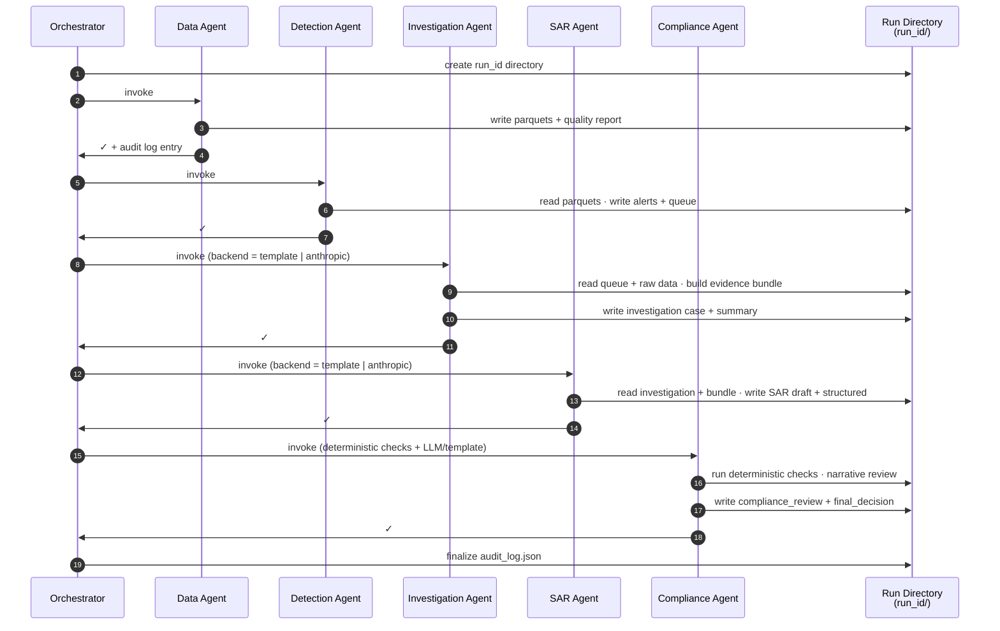
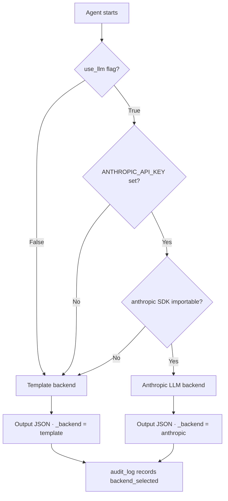

# Orchestration Diagram

## Stage DAG

```mermaid
flowchart LR
    A[Raw xlsx<br/>data/AML Case.xlsx]
    B[Data Agent<br/>deterministic]
    C[Detection Agent<br/>wraps Phase 2 + 3]
    D[Investigation Agent<br/>LLM + template]
    E[SAR Agent<br/>LLM + template]
    F[Compliance Agent<br/>hybrid]
    G[Final Decision<br/>+ Audit Log]

    A --> B
    B -->|"processed_*.parquet<br/>data_quality_report.json"| C
    C -->|"alerts_output.csv<br/>ml_ranked_output.csv<br/>prioritized_alert_queue.json"| D
    D -->|"evidence_bundle.json<br/>investigation_case.json"| E
    E -->|"sar_structured.json<br/>sar_draft.md"| F
    F -->|"compliance_review.json<br/>final_decision.json"| G

    classDef deterministic fill:#dde,stroke:#226,stroke-width:1px;
    classDef llmagent fill:#fde,stroke:#822,stroke-width:1px;
    classDef hybrid fill:#efd,stroke:#262,stroke-width:1px;

    class B,C deterministic;
    class D,E llmagent;
    class F hybrid;
```

## Artifact lineage (sequence view)

```mermaid
sequenceDiagram
    autonumber
    participant O as Orchestrator
    participant DA as Data Agent
    participant DET as Detection Agent
    participant INV as Investigation Agent
    participant SAR as SAR Agent
    participant COM as Compliance Agent
    participant FS as Run Directory<br/>(run_id/)

    O->>FS: create run_id directory
    O->>DA: invoke
    DA->>FS: write parquets + quality report
    DA->>O: ✓ + audit log entry
    O->>DET: invoke
    DET->>FS: read parquets · write alerts + queue
    DET->>O: ✓
    O->>INV: invoke (backend = template | anthropic)
    INV->>FS: read queue + raw data · build evidence bundle
    INV->>FS: write investigation case + summary
    INV->>O: ✓
    O->>SAR: invoke (backend = template | anthropic)
    SAR->>FS: read investigation + bundle · write SAR draft + structured
    SAR->>O: ✓
    O->>COM: invoke (deterministic checks + LLM/template)
    COM->>FS: run deterministic checks · narrative review
    COM->>FS: write compliance_review + final_decision
    COM->>O: ✓
    O->>FS: finalize audit_log.json
```

## Backend selection logic

```mermaid
flowchart TD
    S[Agent starts] --> Q{use_llm flag?}
    Q -->|False| T[Template backend]
    Q -->|True| K{ANTHROPIC_API_KEY set?}
    K -->|No| T
    K -->|Yes| A{anthropic SDK importable?}
    A -->|No| T
    A -->|Yes| L[Anthropic LLM backend]

    T --> O[Output JSON · _backend = template]
    L --> O2[Output JSON · _backend = anthropic]

    O --> AUDIT[audit_log records backend_selected]
    O2 --> AUDIT
```

Same JSON output schema either way. Choice is logged in every run.
